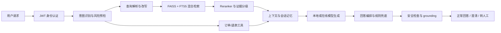

# 外卖客服 RAG 智能问答系统

面向外卖售后场景的企业级 RAG 客服后端。系统将身份认证、知识入库、文档切片、稠密/稀疏/混合检索、证据引用、订单工具、规则安全、澄清、转人工、会话记忆和评测治理串成一条可追踪的服务链路。

[](LICENSE)
[](https://www.python.org/)
[](https://github.com/kue04/llm-customer-service/actions/workflows/ci.yml)

## 项目能力

- **RAG 问答**：意图识别、风险预检、查询改写、多子问题召回、Reranker 精排、证据分级和引用返回。
- **混合检索**：正式 chunk 索引支持 FAISS 稠密检索、SQLite FTS5 稀疏检索和加权 RRF 融合；默认模式为 `hybrid`。
- **企业数据隔离**：JWT 身份认证，服务端按 tenant、发布状态和 document ACL 构造检索范围。
- **工具增强**：订单状态、退款状态等工具结果可进入回答依据；工具失败时保留可诊断的降级信息。
- **稳定降级**：证据不足时返回用户可见澄清回复；高风险或需要人工处理时创建真实转人工工单并返回工单号。
- **安全与治理**：敏感信息脱敏、回复规则、安全拦截、grounding 诊断、审计、反馈和发布/回滚流程。
- **可观测性**：响应包含 `request_id`、`answer_basis`、`citations`、`decision_trace` 和 `full_trace`。

## 系统架构



### 两条检索路径：正式链路与演示链路

<!-- f1-track: chat-service-retrieval=chunk-index -->
<!-- b8-hybrid: default-retrieval-mode=hybrid -->

聊天问答默认使用正式的 `chunk-index` 路径：从文档 chunk 索引召回，并在服务端执行 tenant、发布状态和 document ACL 过滤。`seed-faq-demo` 只保留给演示和兼容调试，不代表正式多租户检索能力。

正式检索接口是 `POST /retrieval/search`，演示接口是 `POST /retrieval/search-demo`。响应中的 `retrieval_path` 会标明实际使用的路径，调用方不需要根据文本猜测检索来源。

正式路径的默认召回模式是 `hybrid`（FAISS 稠密检索 + SQLite FTS5 稀疏检索 + 加权 RRF）。切换或发布 `hybrid` 前，必须先重建同时包含 dense 和 sparse 两路的生效索引，并确认索引状态返回 `sparse_available=true`；否则服务会显式返回不可用错误，不会静默退回其他模式。

核心代码：

| 能力 | 位置 |
| --- | --- |
| HTTP 应用入口 | `main.py` |
| 聊天编排、降级和 trace | `services/chat_service.py` |
| 查询解析与改写 | `services/query_resolution.py`、`services/query_rewrite_provider.py` |
| 意图与风险 | `services/intent_service.py`、`services/safety_guard.py` |
| chunk 检索 | `routers/retrieval.py`、`utils/hybrid_retriever.py`、`utils/sparse_retriever.py` |
| 证据上下文 | `utils/rag_context.py` |
| 回答规则 | `services/answer_composer.py`、`services/reply_rules.py` |
| 文档入库 | `services/ingestion/` |
| 知识运营 | `services/knowledge_service.py` |
| 会话与人工工单 | `services/conversation_store.py`、`services/order_tool_service.py` |

## 快速开始

### 1. 安装依赖

```powershell
git clone https://github.com/kue04/llm-customer-service.git
cd llm-customer-service
python -m venv .venv
.venv/Scripts/python.exe -m pip install -r requirements-dev.txt
```

仅运行测试和静态检查不需要下载大模型：

```powershell
.venv/Scripts/python.exe -m pytest -q
.venv/Scripts/python.exe -m ruff check .
```

### 2. 配置身份认证

受保护接口必须使用 JWT。开发环境至少配置：

```powershell
$env:RAG_JWT_SECRET = "dev-only-secret-change-me-please-32-bytes"
```

服务端从 JWT 推导租户和权限。请求头 `X-User-Role`、`X-Operator-Id` 不能单独认证或提权；请求体中的 `tenant_id`、`operator_id` 不是权限来源。

### 3. 启动服务

完整 RAG 链路需要安装运行时依赖和本地/在线模型配置：

```powershell
.venv/Scripts/python.exe -m pip install -r requirements.txt
.venv/Scripts/python.exe -m uvicorn main:app --host 127.0.0.1 --port 8000
```

启动后访问：

- OpenAPI 文档：`http://127.0.0.1:8000/docs`
- 健康检查：`GET /health`

## 主要接口

| 接口 | 用途 |
| --- | --- |
| `POST /chat/prompt` | 客服问答主入口，返回回答、引用、工具结果和完整 trace |
| `POST /retrieval/search` | 正式 chunk 检索，执行 tenant/ACL/发布状态过滤 |
| `POST /retrieval/prompt-preview` | 预览检索上下文和 prompt 证据 |
| `POST /documents/upload` | 上传并创建文档入库任务 |
| `GET /documents` | 查询当前租户可见文档 |
| `POST /knowledge/...` | 知识草稿、审核、发布和回滚 |
| `POST /chat/review-action` | 接受、编辑发送、转人工等人工动作 |
| `GET /ops/...` | 审计、反馈、发布和质量门禁数据 |

`/retrieval/search-demo` 等种子 FAQ 接口只用于演示和兼容调试，不代表正式多租户检索链路。

### 聊天响应中的稳定模式

- `answer_mode=complete`：证据充分，返回正常回答。
- `answer_mode=clarify`：证据不足，返回用户可见的澄清问题，状态为 `awaiting_clarification`。
- `answer_mode=human_review`：高风险或证据不足需要人工处理，创建真实 handoff ticket，状态为 `human_handoff`，响应包含 `handoff_ticket`。

## 数据与索引

正式聊天链路使用文档 chunk 索引，而不是默认使用种子 FAQ。典型构建流程：

```powershell
.venv/Scripts/python.exe scripts/build_corpus_documents.py
.venv/Scripts/python.exe scripts/build_chunk_index.py
```

索引目录包含 FAISS 向量、manifest 和 FTS5 稀疏索引。发布状态、租户和 ACL 在服务端过滤后才进入召回范围。原始数据、模型和生成索引不应提交到 Git；仓库中的样例数据仅用于测试和演示。

## 评测与质量门禁

常用命令：

```powershell
.venv/Scripts/python.exe scripts/evaluate_hybrid_retrieval.py --top-k 10
.venv/Scripts/python.exe scripts/evaluate_chat_grounding.py --legacy-seed
.venv/Scripts/python.exe scripts/check_repo_data_size.py
.venv/Scripts/python.exe -m pytest -q
```

测试覆盖认证、租户隔离、ACL、文档入库、检索、回答规则、工具降级、人工转接和发布回滚。详细评测口径见：

- `docs/EVALUATION.md`
- `docs/RAG_ENTERPRISE_ACCEPTANCE_SPEC.md`
- `docs/RAG_DEV_PITFALLS.md`

## 项目结构

```text
main.py                 FastAPI 应用入口
routers/                HTTP 路由与权限声明
services/               业务编排、入库、知识运营、工具和治理
utils/                  检索、重排、证据和数据处理
schemas/                请求/响应模型
scripts/                建库、评测、检查和运维脚本
data/                   样例数据与本地运行数据，不提交生产数据
tests/                  单元、接口、隔离和发布门禁测试
docs/                   API、评测、设计和运维文档
```

## 生产注意事项

- 生产环境必须使用独立 JWT 密钥、真实身份提供方和持久化数据库/对象存储。
- `RAG_CHAT_RETRIEVAL_MODE` 可用于显式诊断模式；正式默认值为 `hybrid`，缺少稀疏索引时应显式失败，不静默降级。
- 需要人工处理的请求不要只依赖前端标记；服务端会创建 handoff ticket，并在响应和会话状态中记录结果。
- 评测报告必须注明数据来源、索引版本和 `retrieval_path`。正式 chunk 语料使用 `scripts/evaluate_hybrid_retrieval.py`；seed FAQ 只能通过 `--legacy-seed` 显式运行，不能替代生产指标。

## 相关文档

- `docs/API_INTEGRATION.md`：接口调用和身份认证
- `docs/ENTERPRISE_AI_CUSTOMER_SERVICE_PRD.md`：产品边界和业务流程
- `docs/RAG_DOCUMENT_CORPUS_PLAN.md`：文档语料和入库计划
- `HANDOFF.md`：开发交接和历史决策
- `AGENT.md`：仓库协作约束

## License

MIT
