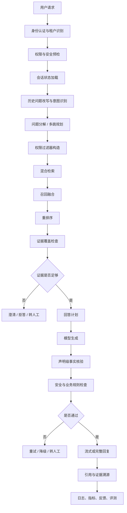
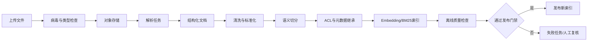

理想状态下，这个项目不是“上传文档后问答”，而是一套具备数据治理、权限控制、检索、生成、验证、追踪和反馈闭环的企业级 RAG 系统。


系统通过ai开发 但是开发中遇到的坑以及问题也要同步记录下来 你可以自己创一个文档记录 用于后续面试提问开发流程遇到的问题以及解决方案等等

## 一、系统最终要解决什么问题

它应该能够稳定解决以下问题：

1. 从 PDF、Word、网页、Markdown、Excel、扫描件中提取可检索内容。
2. 识别标题、章节、表格、列表、页码、图片、脚注和版本信息。
3. 对长文档进行结构化切分，避免整篇文档或固定长度截断导致语义丢失。
4. 只检索当前用户有权限访问的内容。
5. 处理单轮、多轮、多跳问题。
6. 在检索不到答案时拒答、澄清或转人工，而不是编造。
7. 每一个回复结论都能追溯到具体文档、版本、页码、段落和 Chunk。
8. 支持流式交互，同时保证高风险回复不会在校验前泄漏。
9. 能够通过离线评测和线上反馈持续发现问题、回流数据和改进模型。

不应承诺“任何复杂文档都能 100% 正确解析”。正确目标是：

> 对支持范围内的文档，解析结果可验证；无法可靠解析的内容必须被识别、标记并进入人工处理，而不是静默入库。

------

# 二、理想总体架构

````

````

文档入库是另一条异步链路：

````

````

------

# 三、文档接入和解析流程

## 1. 文件接入

上传时必须记录：

```
tenant_id
knowledge_base_id
document_id
source_uri
source_type
file_name
file_size
content_hash
uploader
created_at
```

上传阶段完成：

- 文件大小限制
- MIME 和文件内容双重校验
- 病毒扫描
- SHA-256 去重
- 租户隔离
- 对象存储
- 创建异步任务

上传接口不能直接同步完成解析，否则大文件会阻塞 API。

## 2. 解析结果不能只保存纯文本

解析结果应保留结构：

```
{
  "document_id": "doc_001",
  "version": 3,
  "title": "退款规则",
  "blocks": [
    {
      "block_id": "doc_001_v3_b_0001",
      "type": "paragraph",
      "text": "退款申请提交后...",
      "page_start": 4,
      "page_end": 4,
      "heading_path": ["售后规则", "退款时效"],
      "bbox": [80, 120, 520, 180],
      "source_span": [1024, 1087]
    }
  ]
}
```

每个 Block 应有稳定 ID。这样后续回答可以定位到：

```
文档 → 版本 → 页码 → Block → Chunk → 证据声明
```

## 3. 不同文档类型的处理方式

### PDF

需要处理：

- 文本型 PDF
- 扫描型 PDF
- 多栏排版
- 页眉页脚
- 页码
- 表格
- 图片
- 跨页段落
- 跨页表格

不能简单按照页码把内容截断。跨页表格和跨页段落必须保留连续关系。

### Word

需要保留：

- 标题层级
- 段落
- 列表
- 表格
- 脚注
- 图片说明
- 文档属性

### HTML

需要清理：

- 导航栏
- 广告
- 页脚
- 脚本
- 重复菜单
- 无关推荐内容

同时保留：

- 页面标题
- H1/H2/H3 层级
- 正文
- 表格
- 链接文本
- 来源 URL
- 抓取时间

### 扫描件

OCR 必须设置质量判断：

```
OCR 字符数
OCR 置信度
乱码比例
语言识别
版面识别结果
```

如果 OCR 置信度过低，不得直接发布到知识库，而应进入人工复核。

## 4. 解析质量门禁

文档解析后必须自动检查：

- 文本是否为空
- 文本长度是否异常
- 乱码比例是否超过阈值
- 重复段落比例是否过高
- 标题结构是否有效
- 表格是否被错误展开
- 页码是否连续
- OCR 置信度是否达标
- 文档是否与上一个版本重复
- 是否存在解析警告

解析失败要进入明确状态：

```
parse_failed
parse_low_quality
parse_requires_review
duplicate
parsed
```

不能把所有文件都标记为成功。

------

# 四、Chunk 切分和入库

## 1. 理想的切分策略

不建议只使用固定字符数切分。应采用分层策略：

```
文档结构
→ 章节
→ 段落
→ 句子
→ 语义 Chunk
→ 父子 Chunk
```

建议：

- 普通文本：300–600 tokens
- 最大长度：700–800 tokens
- 重叠：50–100 tokens
- 表格：按表头和行组切分
- 代码：按函数或类切分
- FAQ：问题和答案尽量保持在同一 Chunk
- 长章节：建立 parent chunk 和 child chunk

## 2. Chunk 元数据

每个 Chunk 至少保存：

```
{
  "chunk_id": "doc_001_v3_c_0042",
  "parent_chunk_id": "doc_001_v3_p_0008",
  "tenant_id": "tenant_a",
  "document_id": "doc_001",
  "document_version": 3,
  "source_uri": "s3://...",
  "page_start": 12,
  "page_end": 13,
  "heading_path": ["退款", "到账时效"],
  "content_hash": "sha256...",
  "acl": ["role:agent", "group:after_sales"],
  "effective_at": "2026-01-01",
  "expired_at": null
}
```

权限和有效期必须随 Chunk 一起进入索引，否则检索阶段无法可靠过滤。

## 3. 入库状态

推荐状态：

```
uploaded
stored
parsed
normalized
chunked
embedded
indexed
pending_review
published
archived
expired
failed
```

状态不能通过人工直接修改数据库绕过流程。

------

# 五、检索流程

## 1. 用户问题先做预处理

原始问题：

```
“我上次那个订单怎么还没退钱？”
```

不能直接拿去检索。系统需要结合会话上下文，改写为：

```
“用户询问订单 xxx 退款申请后的到账进度和预计到账时间”
```

同时输出：

```
{
  "original_query": "我上次那个订单怎么还没退钱？",
  "rewritten_query": "订单 xxx 退款申请后的到账进度和预计到账时间",
  "intent": "退款进度",
  "entities": {
    "order_id": "xxx"
  },
  "conversation_dependencies": ["turn_3", "turn_5"]
}
```

原始问题不能丢失，改写结果也必须进入 trace。

## 2. 混合检索

完整检索不应只依赖向量：

```
Dense Retrieval
+ BM25 / Sparse Retrieval
+ Metadata Filter
+ Tenant Filter
+ ACL Filter
+ Time Validity Filter
```

然后使用 RRF 或加权融合：

```
Dense 候选
BM25 候选
关键词精确匹配
标题匹配
意图匹配
```

## 3. Reranker 不能单独决定业务正确性

Reranker 只能判断文本相关性，还需要结合：

- 意图匹配
- 文档版本
- 来源可信度
- 有效期
- 权限
- 业务优先级
- 证据之间是否冲突

例如“退款到账时间”和“商家拒绝退款”可能语义相关，但业务结论完全不同。

## 4. 证据充分性判断

检索后要判断：

```
是否有主证据
是否覆盖用户核心问题
是否存在冲突证据
证据是否过期
证据置信度是否足够
是否需要继续检索
```

如果只有相关但不完整的证据，系统应：

- 继续检索
- 拆分问题
- 询问澄清问题
- 保守回答
- 转人工

不能因为召回了一个文本就强行回答。

------

# 六、多轮、多跳对话

## 1. 多轮对话

多轮对话至少要分成四类状态：

```
用户身份状态
订单/业务实体状态
当前问题状态
长期偏好与事实状态
```

例如：

```
用户：我的订单少了一份餐
客服：请提供订单号
用户：就是刚才那个
```

系统需要知道“刚才那个”指的是哪个订单，而不是只把最近几条文本拼进 Prompt。

## 2. 多轮问题改写

每一轮都应保留：

```
original_query
resolved_query
conversation_summary
active_entities
unresolved_slots
```

摘要不能只是字符串拼接，应有结构化状态：

```
{
  "active_order_id": "ORDER-001",
  "current_intent": "少送漏送",
  "unresolved_questions": ["是否已经提交售后"],
  "facts": {
    "user_has_photo": true
  }
}
```

## 3. 多跳问题

多跳问题例如：

> “这个订单为什么被取消？钱什么时候退？如果还没到账我应该找谁？”

应拆成：

```
子问题 1：订单取消原因
子问题 2：退款到账规则
子问题 3：未到账后的处理入口
```

每个子问题独立检索，再进行结果合并。

理想流程：

```
问题分解
→ 子问题检索
→ 子问题证据验证
→ 依赖关系排序
→ 综合回答
→ 每个结论分别绑定证据
```

如果子问题 2 没有证据，不能因为子问题 1 有证据就直接补全答案。

------

# 七、上下文变长时怎么办

不能无限把历史对话塞进 Prompt。应该采用分层上下文：

## 1. 当前上下文

保留最近几轮原文，用于理解指代和语气。

## 2. 结构化会话状态

保存：

- 当前订单
- 当前意图
- 已确认事实
- 未解决问题
- 已执行工具
- 已给出的承诺
- 风险状态

## 3. 历史摘要

对较早对话做摘要，但摘要必须可追踪到原始 turn ID。

## 4. 相关历史检索

长会话中，不是把所有历史都放入上下文，而是根据当前问题检索相关历史消息。

## 5. 上下文预算

每次请求先分配预算：

```
系统提示：固定预算
当前问题：固定预算
会话状态：固定预算
最近消息：有限预算
相关历史：有限预算
检索证据：主要预算
模型输出：固定预算
```

超过预算时按优先级裁剪：

```
当前问题和安全规则
> 当前订单状态
> 主证据
> 最近相关对话
> 旧历史摘要
```

不能简单从字符串尾部截断，因为可能把问题和证据截开。

------

# 八、回复质量如何衡量

回复质量不能只看“模型感觉不错”，至少要拆成五类指标。

## 1. 检索质量

```
Recall@1
Recall@5
MRR
NDCG
Intent Hit Rate
Evidence Coverage
```

## 2. 事实性

检查：

- 回复结论是否被证据支持
- 是否引用了不存在的信息
- 是否混淆不同文档的条件
- 是否使用过期规则
- 是否出现未经证据支持的承诺

## 3. 任务完成度

例如客服场景需要分别评估：

- 是否回答用户问题
- 是否提供下一步动作
- 是否说明限制条件
- 是否正确调用订单工具
- 是否需要人工介入

## 4. 安全性

检查：

- 是否越权泄露
- 是否绕过平台规则
- 是否虚假承诺赔偿
- 是否暴露隐私
- 是否给出危险操作
- 是否在证据不足时装作确定

## 5. 体验指标

```
首 token 延迟
完整回复延迟
P50/P95/P99
澄清率
拒答率
转人工率
用户追问率
用户满意度
```

当前项目的回答评测可以继续使用，但需要扩大样本、增加人工标注，并将检索质量、事实性、安全性和任务完成度分开统计。

------

# 九、回复证据如何溯源

理想情况下，每个回答不是只有一组引用，而是每个声明都绑定证据。

模型生成前先形成回答计划：

```
{
  "claims": [
    {
      "claim_id": "claim_001",
      "text": "退款通常会原路退回",
      "evidence_ids": ["ev_001"],
      "confidence": 0.91
    },
    {
      "claim_id": "claim_002",
      "text": "具体到账时间取决于支付渠道",
      "evidence_ids": ["ev_002"],
      "confidence": 0.83
    }
  ]
}
```

证据对象需要保存：

```
{
  "evidence_id": "ev_001",
  "chunk_id": "doc_001_v3_c_0042",
  "document_id": "doc_001",
  "document_version": 3,
  "title": "退款规则",
  "page_start": 12,
  "page_end": 13,
  "heading_path": ["售后", "退款"],
  "retrieval_method": "dense_bm25_rrf",
  "dense_score": 0.84,
  "bm25_score": 12.2,
  "rerank_score": 0.91,
  "retrieved_at": "2026-09-23T10:00:00Z"
}
```

最终 trace 应能回答：

```
这句话来自哪份文档？
使用的是哪个版本？
原文在第几页？
对应哪个 Chunk？
检索分数是多少？
为什么选择它？
生成时引用了它吗？
回复发布前是否通过核验？
```

------

# 十、失败时怎么处理

失败不能只有一个通用兜底回复，要按阶段分类。

## 1. 上传失败

原因：

- 文件过大
- 类型不支持
- 内容损坏
- 病毒扫描失败

处理：

```
拒绝上传
返回明确错误码
不创建可检索文档
```

## 2. 解析失败

处理：

```
标记 parse_failed
保存错误原因和 parser 版本
允许重新解析
必要时转人工
```

## 3. 解析质量低

例如 OCR 乱码严重：

```
标记 parse_requires_review
不进入生产索引
允许人工确认后发布
```

## 4. 索引失败

处理：

```
保留旧索引
新索引进入 failed
记录失败原因
支持重试
禁止部分替换线上索引
```

## 5. 检索不到证据

分三种情况：

### 完全没有结果

回复：

```
我没有找到足够资料确认这个问题。请补充订单号或具体时间，我再继续核实。
```

### 找到相关但不充分

回复：

```
目前只能确认退款已提交，但没有找到具体到账时间规则。需要进一步核实支付渠道。
```

### 找到冲突证据

回复：

```
当前资料存在版本差异，我不能直接给出确定结论，建议转人工确认。
```

## 6. 生成失败

包括：

- 模型超时
- 模型服务不可用
- 输出格式错误
- 内容超出上下文
- 证据核验失败

降级顺序：

```
模型重试
→ 缩短上下文
→ 使用结构化模板
→ 使用规则答案
→ 转人工
```

## 7. 高风险流式回复

不能先把未经验证的模型 Token 全部发送出去，再事后检查。已经发送的 Token 无法撤回。

理想策略是：

```
先流式发送状态事件
→ 检索完成
→ 生成回答
→ 按句或按声明缓冲
→ 完成事实与安全核验
→ 通过后发送正文
```

对于低风险普通问答，可以采用较小缓冲；对于退款、赔偿、账户、隐私和合规场景，必须先验证再发送正文。

------

# 十一、一次完整请求示例

用户：

> “我上次那个订单显示已送达，但我没收到，应该怎么办？”

系统流程：

1. 校验 JWT，确认用户和租户。

2. 加载会话状态，解析“上次那个订单”对应的订单号。

3. 调用订单工具确认订单状态。

4. 将原始问题改写为：

   ```
   订单 ORDER-001 显示已送达但用户未收到，询问处理流程
   ```

5. 识别意图：

   ```
   未收到货 / 配送异常 / 高风险售后
   ```

6. 构造租户和 ACL 过滤器。

7. Dense + BM25 检索。

8. RRF 融合并使用 reranker 排序。

9. 找到：

   - 主证据：订单显示已送达但未收到的处理规则
   - 辅助证据：申诉入口和凭证要求

10. 检查证据是否覆盖：

    - 应该怎么办
    - 是否需要提交申诉
    - 需要什么材料

11. 生成回答计划。

12. 模型生成。

13. 按声明检查证据：

    - “可以提交未收到货申诉”有证据
    - “一定赔偿”没有证据，删除

14. 运行安全规则。

15. 通过后返回：

    - 回复正文
    - 引用文档
    - 证据页码
    - 会话 trace
    - 风险等级
    - 是否需要人工

16. 保存匿名化日志和用户反馈候选。

------

# 十二、理想项目的验收标准

建议最终把系统验收分为四档：

## A. 文档入库

- 支持 PDF、DOCX、HTML、Markdown
- 解析结构可验证
- OCR 低质量可识别
- Chunk 有稳定 ID
- 版本和 ACL 完整
- 失败可重试
- 重复文件幂等

## B. 检索

- Recall@5 达到业务目标
- 权限过滤 100% 正确
- 过期和未发布内容不被召回
- 多轮问题可正确改写
- 多跳问题可拆解并合并证据
- 检索失败有明确降级

## C. 回复

- 事实性通过率
- 证据覆盖率
- 拒答准确率
- 高风险错误承诺为零
- 回复引用可定位到页码和 Chunk
- 生成失败可降级

## D. 工程稳定性

- 并发压测达到目标 QPS
- P95 延迟满足目标
- 超时、取消、重试正常
- 索引构建失败不影响线上服务
- 数据库和 Redis 可恢复
- 所有关键请求有 request ID 和 trace ID

这个项目的理想定位应是：

> 一个支持多格式文档、结构化解析、版本化知识治理、租户级权限、混合检索、多轮和多跳对话、声明级证据核验、可控流式输出以及完整失败降级的生产级 RAG 客服平台。

当前项目距离这个目标，最核心的差距仍然是：文档解析质量门禁、结构化 Chunk、真实身份与 ACL、历史问题改写、多跳规划、声明级证据核验和生产级失败处理。

